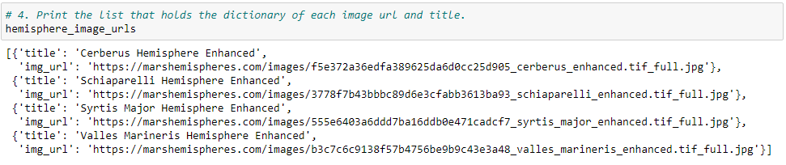
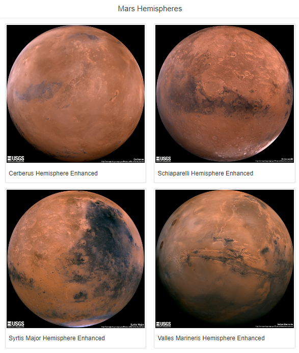
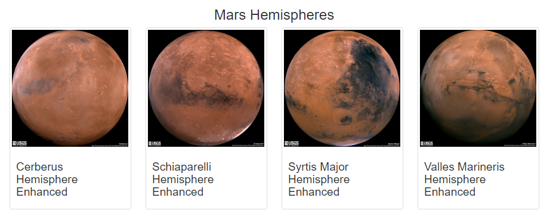

# Mission to Mars
Scraping multiple websites to get data and store the data in a Mongo Database and display it in a simple, single HTML page.

## Objective:

- Collect the latest news related to MARS exploration
- Get a featured MARS Image
- Collect facts about MARS
- Collect pictures about MARS Hemispheres

### Tools and Resources
- Tools
  - Jupyter Notebook
  - Flask
  - Mongo DB
  - Html

- Resources
  - Mars News: https://redplanetscience.com
  - Featured Image: https://spaceimages-mars.com
  - Mars Facts: https://galaxyfacts-mars.com
  - Mars Hemispheres: https://marshemispheres.com

### Gathering new images for Mars Hemispheres

Leveraging Beautiful Soup and Splinter, I created a code to capture the full resolution images from the Mars Hemispheres site and saved these URLs in a list. The result is below  
  

### Populating the app with the new images gathered in the web-page

### Changing the html to make the page responsive

